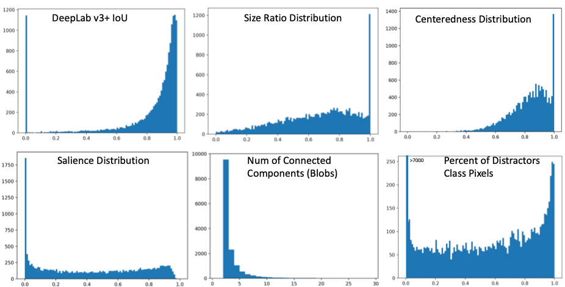

## TOSS Design Consideration

### Considered Attributes
The file data/analysis/test\_stats lists some of the attributes we consider for arriving at a good test dataset with a manageable number of dimensions.
The attributes include:
|-----------------------|----------------------|-----------------------------|--------------------|----------|------------|-------------------------|
| Baseline one-shot IoU | IoU with DeepLab v3+ | Mask BBox size / Image size | Centeredness=      | Salience | Blob Count | Fraction of Distractors |
| (BIoU)                |                      |                             | 1-dis_\from\_center|          |            |                         |
|-----------------------|----------------------|-----------------------------|--------------------|----------|------------|-------------------------|

Of these, the DeepLab v3+ iou is a composite factor because it entails several other latent/unconsidered factors for diminished performance. Also
as presented in the paper, baseline one-shot performance follows the same trend as supervised accuray with DeepLab v3+. So the first attribute considered
is IoU with DeepLab v3+.

Of the others, the maximum mutual information for BIoU being greater than or lesser than 0.5, is obtained from Salience. 
|-------------------------|------------|------------|-----------|------------|------------|------------|
|                         | DL v3+ IoU |   Size     |  Center   |  Salience  | Blob Cnt   |Distractors |
|-------------------------|------------|------------|-----------|------------|------------|------------|
| Mutual info(BIoU > 0.5) | 0.09052653 | 0.03299302 | 0.0218922 | 0.21073617 | 0.00232588 | 0.16151821 |
|-------------------------|------------|------------|-----------|------------|------------|------------|

Thus we chose Salience as the second attribute for dividing the test files.

### Using training class images in the test set
We observe that the PASCAL 5i test set is quite small. We therefore include training class images as part of the test set.
This is valid because we still differentiate betwee the training <i>classes</i> and the test classes. 
viz. a network trained for a fold with test classes {c1, c2, c3, c4, c5} are only tested against annotations for these classes, albeit the images themselves
maybe from the training set. 
